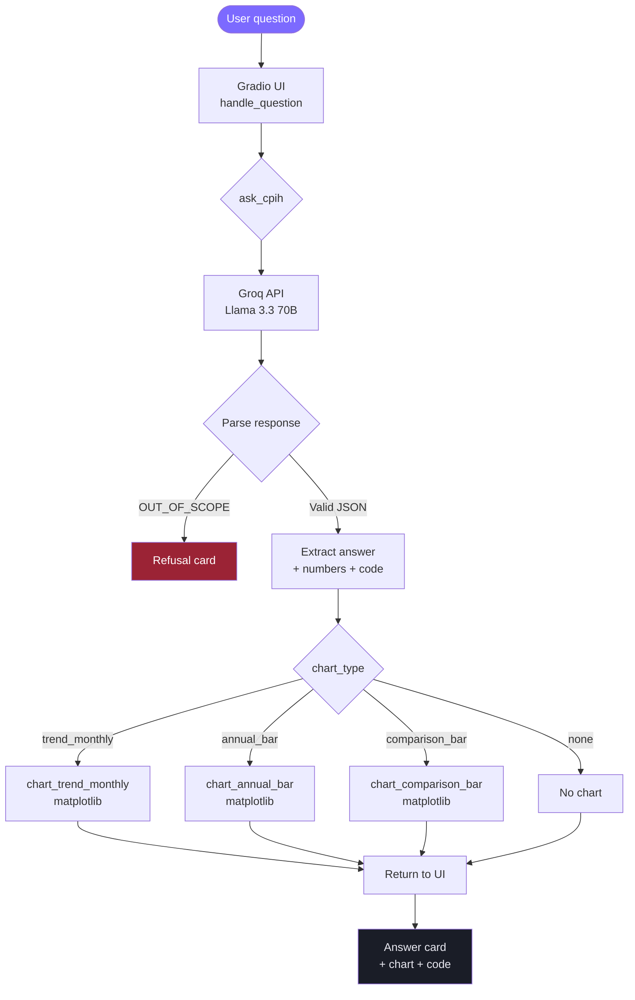

# GenAI assignment solution

Flow :

-----------------------------------------------------------------------------------------------------------------------------------------
Brief explanation of each stage:

User question → Gradio UI — the question is typed or clicked from examples and passed to handle_question().

ask_cpih() → Groq API — the full ONS dataset is embedded in the system prompt alongside strict JSON output instructions, then sent to Llama 3.3 70B.

Parse JSON response — the response is cleaned of markdown fences, the outermost {} block is extracted, and trailing commas are fixed. If the model prefixed OUT_OF_SCOPE:, the refusal path short-circuits here and shows a red card.

Extract answer + numbers + provenance code — the three fields from the JSON are pulled out. The code field is the auditable pandas snippet the model generated.

Select chart type — the model also returns a chart_type enum (trend_monthly, annual_bar, comparison_bar, or none) plus parameters. The correct matplotlib helper is called with those params against the real pandas DataFrames — not the model's stated numbers.

Answer + chart + provenance — all three are returned to the Gradio UI and rendered together.

-----------------------------------------------------------------------------------------------------------------------------------------

Solution reply Status - UNK
